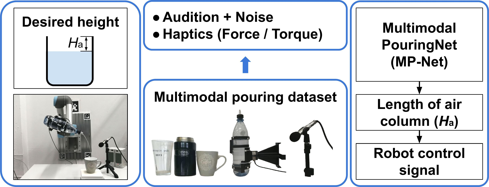
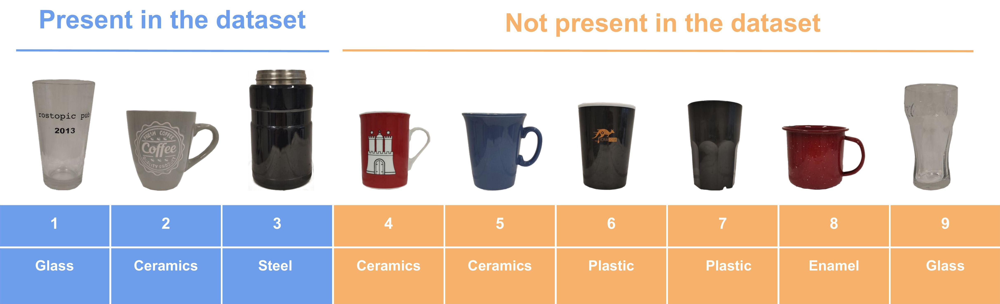
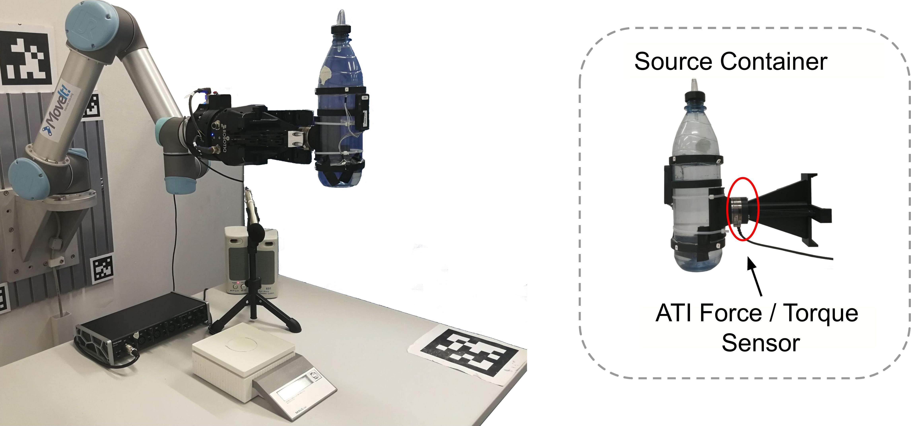
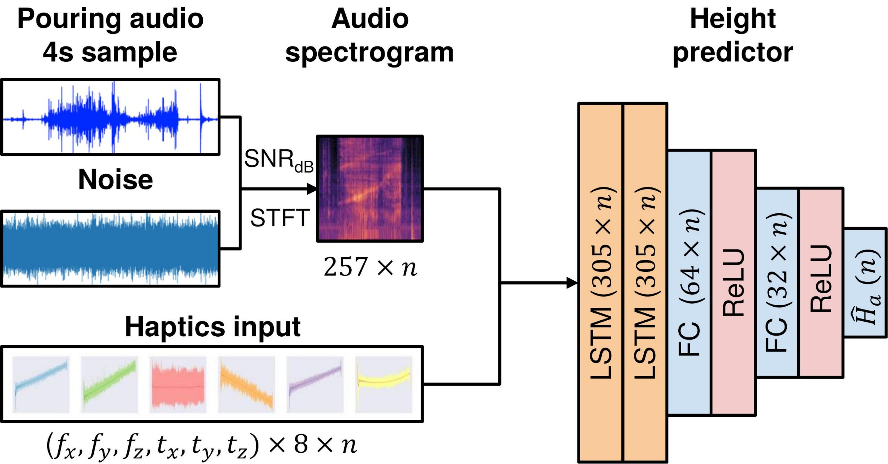

## Abstract
In this paper ([arXiv](https://arxiv.org/abs/2003.00342), [code](https://github.com/lianghongzhuo/MultimodalPouring), [video](https://youtu.be/_U7zTyS338I)), we focus on the robust and accurate estimation of liquid height for robotic pouring. However, vision-based methods often fail in occluded conditions while audio-based methods cannot work well in a noisy environment. We instead propose a multimodal pouring network (MP-Net) that is able to robustly predict liquid height by conditioning on both audition and haptics input. MP-Net is trained on a self-collected multimodal pouring dataset. This dataset contains 300 robot pouring recordings with audio and force/torque measurements for three types of target containers. We also augment the audio data by inserting robot noise. We evaluated MP-Net on our collected dataset and a wide variety of robot experiments. Both network training results and robot experiments demonstrate that MP-Net is robust against noise and changes to the task and environment. Moreover, we further combine the predicted height and force data to estimate the shape of the target container.

## Overview
<div style="text-align:center">

</div>

## Video
<div style="text-align:center">
<iframe width="560" height="315" src="https://www.youtube.com/embed/_U7zTyS338I" frameborder="0" allow="accelerometer; autoplay; encrypted-media; gyroscope; picture-in-picture" allowfullscreen></iframe>
</div>

## Target containers
<div style="text-align:center">

</div>

## Dataset and experiment setup
<div style="text-align:center">

</div>

## Network
<div style="text-align:center">

</div>


## Code
Code of this project can be found at [https://github.com/lianghongzhuo/MultimodalPouring](https://github.com/lianghongzhuo/MultimodalPouring).

## Dataset
Please contact Hongzhuo Liang (liang[at]informatik.uni-hamburg.de) for the download link.

## Citation

If you found this paper useful in your research, please consider citing:

```plain
@inproceedings{liang2020MultimodalPouring,
  title     = {Robust Robotic Pouring using Audition and Haptics},
  author    = {Liang, Hongzhuo and Zhou, Chuangchuang and Li, Shuang and Ma, Xiaojian and Hendrich, Norman and Gerkmann, Timo and Sun, Fuchun and Zhang, Jianwei},
  booktitle = {IEEE/RSJ International Conference on Intelligent Robots and Systems (IROS)},
  year      = {2020},
  pages     = {10880-10887}
}
```
