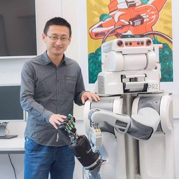

# About me

Hello! I am Hongzhuo Liang. I completed my doctoral training in robot perception and manipulation at the Department of Informatics, the University of Hamburg (UHH), with Prof. Dr. Jianwei Zhang from 2016 to 2022. I am currently a postdoc research fellow of UHH, with research interests in robot grasping and dexterous manipulation.

# Publications
My publications can be found here: [Link](https://lianghongzhuo.github.io/publications)

# Contact
- Email: hongzhuo.liang@uni-hamburg.de
- My home page at Universität Hamburg: [Link](https://tams.informatik.uni-hamburg.de/people/liang/)
