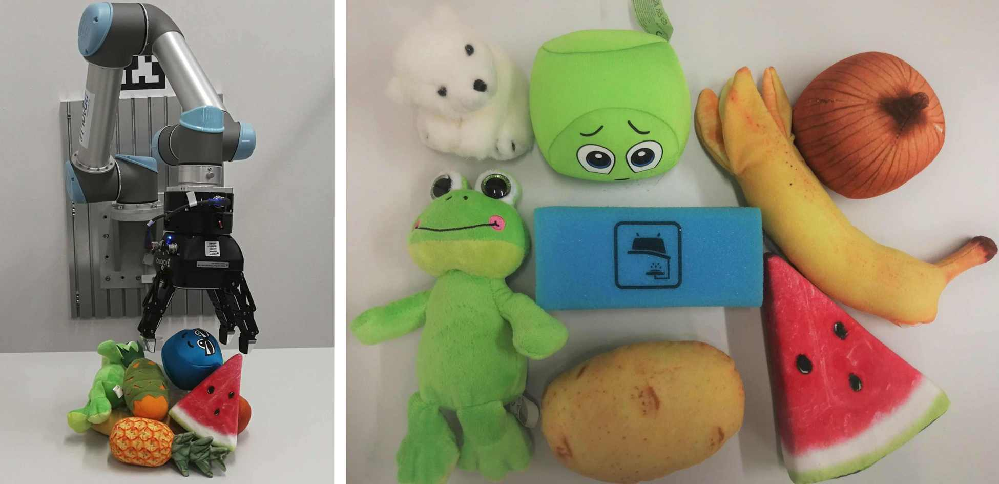

# Publications

## 2021
- **Hongzhuo Liang**, Lin Cong, Norman Hendrich, Shuang Li, Fuchun Sun and Jianwei Zhang, "**Multifingered Grasping Based on Multimodal Reinforcement Learning**", IEEE Robotics and Automation Letters. [[Project page]](https://lianghongzhuo.github.io/multifinger_rl_grasp/)

## 2020
- **Hongzhuo Liang**, Chuangchuang Zhou, Shuang Li, Xiaojian Ma, Norman Hendrich, Timo Gerkmann, Fuchun Sun, Marcus Stoffel and Jianwei Zhang, "**Robust Robotic Pouring using Audition and Haptics**", International Conference on Intelligent Robots and Systems (IROS) 2020, Las Vegas, USA. [[Project page]](https://lianghongzhuo.github.io/MultimodalPouring/) [[PDF]](https://arxiv.org/abs/2003.00342) [[Video]](https://youtu.be/_U7zTyS338I) [[Code]](https://github.com/lianghongzhuo/MultimodalPouring)

<iframe width="560" height="315" src="https://www.youtube.com/embed/_U7zTyS338I" frameborder="0" allow="accelerometer; autoplay; encrypted-media; gyroscope; picture-in-picture" allowfullscreen></iframe>

- Shuang Li, Jiaxi Jiang, Philipp Ruppel, **Hongzhuo Liang**, Xiaojian Ma, Norman Hendrich, Fuchun Sun, Jianwei Zhang, "**A Mobile Robot Hand-Arm Teleoperation System by Vision and IMU**", International Conference on Intelligent Robots and Systems (IROS) 2020, Las Vegas, USA. [[Project page]](https://smilels.github.io/multimodal-translation-teleop/) [[PDF]](https://arxiv.org/abs/2003.05212) [[Video]](https://youtu.be/rAj2IWl2ezs) [[Code]](https://github.com/Smilels/multimodal-translation-teleop/)

<iframe width="560" height="315" src="https://www.youtube.com/embed/rAj2IWl2ezs" frameborder="0" allow="accelerometer; autoplay; encrypted-media; gyroscope; picture-in-picture" allowfullscreen></iframe>

- Lin Cong, Michael Görner, Philipp Ruppel, **Hongzhuo Liang**, Norman Hendrich, Jianwei Zhang, "**Self-Adapting Recurrent Models for Object Pushing from Learning in Simulation**", International Conference on Intelligent Robots and Systems (IROS) 2020, Las Vegas, USA. [[PDF]](https://arxiv.org/abs/2007.13421) [[Video]](https://youtu.be/z-gTJMs9tFg)[[Code]](https://github.com/HitLyn/RMPPI)

<iframe width="560" height="315" src="https://www.youtube.com/embed/z-gTJMs9tFg" frameborder="0" allow="accelerometer; autoplay; encrypted-media; gyroscope; picture-in-picture" allowfullscreen></iframe>

- Jinpeng Mi, **Hongzhuo Liang**, Nikolaos Katzakis, Changshui Zhang and Jianwei Zhang, "**Intention-Related Natural Language Grounding via Object Affordance Detection and Intention Semantic Extraction**", Frontiers in Neurorobotics. [[PDF]](https://doi.org/10.3389/fnbot.2020.00026)

## 2019
- **Hongzhuo Liang**, Shuang Li, Xiaojian Ma, Norman Hendrich, Timo Gerkmann, and Jianwei Zhang, "**Making sense of Audio Vibration for Liquid Height Estimation in Robotic Pouring**", International Conference on Intelligent Robots and Systems (IROS) 2019, Macau, China. [[Project page]](https://lianghongzhuo.github.io/AudioPouring/) [[PDF]](https://arxiv.org/abs/1903.00650) [[Video]](https://www.youtube.com/watch?v=Za8dDjGFE1k) [[Code]](https://github.com/lianghongzhuo/AudioPouring)

<iframe width="560" height="315" src="https://www.youtube.com/embed/tdIcJb80qPc" frameborder="0" allow="accelerometer; autoplay; encrypted-media; gyroscope; picture-in-picture" allowfullscreen></iframe>

- **Hongzhuo Liang**, Xiaojian Ma, Shuang Li, Michael Görner, Song Tang, Bin Fang, Fuchun Sun, and Jianwei Zhang, "**PointNetGPD: Detecting Grasp Configurations from Point Sets**", International Conference on Robotics and Automation (ICRA) 2019, Montreal, Canada. [[Project page]](https://lianghongzhuo.github.io/PointNetGPD/)[[PDF]](https://arxiv.org/abs/1809.06267) [[Video]](https://youtu.be/uYl9m8PhfaI) [[Code]](https://github.com/lianghongzhuo/PointNetGPD)

<iframe width="560" height="315" src="https://www.youtube.com/embed/uYl9m8PhfaI" frameborder="0" allow="accelerometer; autoplay; encrypted-media; gyroscope; picture-in-picture" allowfullscreen></iframe>

<iframe width="560" height="315" src="https://www.youtube.com/embed/H3DpFll0HJY" frameborder="0" allow="accelerometer; autoplay; encrypted-media; gyroscope; picture-in-picture" allowfullscreen></iframe>

- Shuang Li, Xiaojian Ma, **Hongzhuo Liang**, Michael Görner, Philipp Ruppel, Bin Fang, Fuchun Sun, and Jianwei Zhang, "**Vision-based Teleoperation of Shadow Dexterous Hand using End-to-End Deep Neural Network**", International Conference on Robotics and Automation (ICRA) 2019, Montreal, Canada. [[PDF]](https://arxiv.org/abs/1809.06268) [[Video]](https://youtu.be/I1FTJ87CtDs) [[Code]](https://github.com/TAMS-Group/TeachNet_Teleoperation)

<iframe width="560" height="315" src="https://www.youtube.com/embed/I1FTJ87CtDs" frameborder="0" allow="accelerometer; autoplay; encrypted-media; gyroscope; picture-in-picture" allowfullscreen></iframe>

## 2018

- **Hongzhuo Liang**, Shuang Li, Michael Görner, and Jianwei Zhang "**Generating Robust Grasps for Unknown Objects in Clutter Using Point Cloud Data**", in Shanghai International Symposium on Human-Centered Robotics (HCR), 2018 [[PDF]](https://tams.informatik.uni-hamburg.de/people/liang/publications/liang2018a.pdf)

- Shuang Li, **Hongzhuo Liang**, and Jianwei Zhang "**Path Planning for Wheeled Mobile Service Robots based on Improved Genetic Algorithm**", in Shanghai International Symposium on Human-Centered Robotics (HCR), 2018 [[PDF]](https://tams.informatik.uni-hamburg.de/people/liang/publications/li2018a.pdf)

## 2017
- Zhen Deng, Haojun Guan, Rui Huang, **Hongzhuo Liang**, Liwei Zhang and Jianwei Zhang "**Combining Model-based Q-learning with Structural Knowledge Transfer for Robot Skill Learning**", in IEEE Transactions on Cognitive and Developmental Systems, vol. 11, no. 1, pp. 26-35, March 2019. [[PDF]](https://ieeexplore.ieee.org/document/7955051/)

## Under review
- Lin Cong, **Hongzhuo Liang**, Philipp Ruppel, Yunlei Shi, Michael Görner, Norman Hendrich, and Jianwei Zhang, "**Reinforcement Learning with Visio-Proprioception Model for Robot Planar Pushing**".

- Wenkai Chen, **Hongzhuo Liang**, Zhaopeng Chen, Fuchun Sun and Jianwei Zhang, "**Improving Object Grasp Performance via Transformer-based Sparse Shape Completion**", pre-print.
